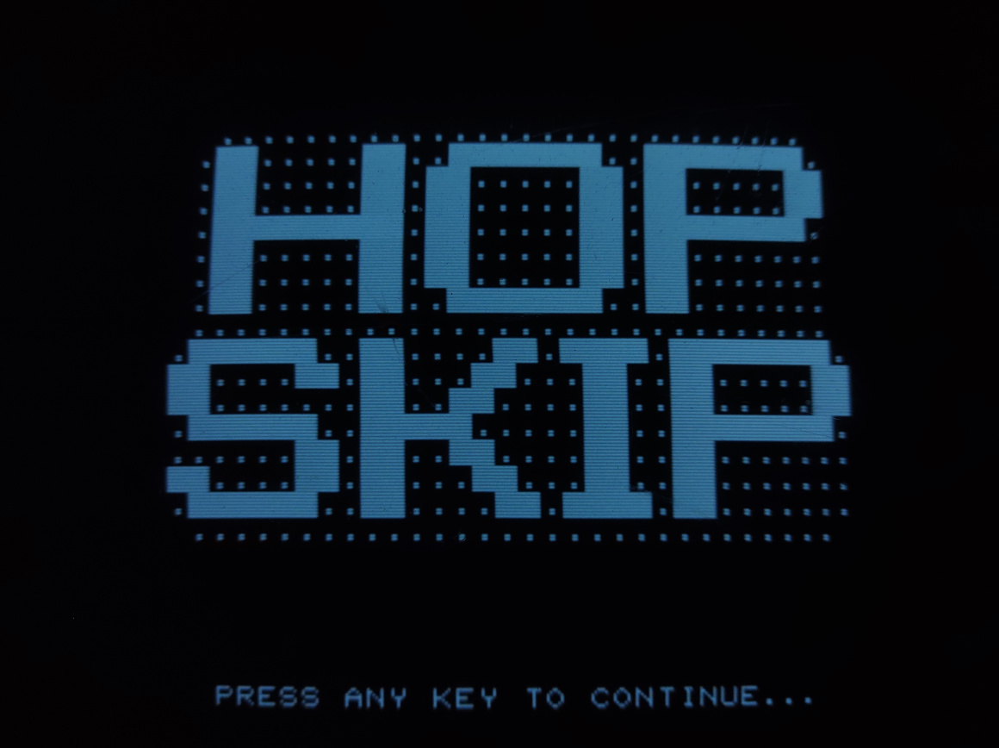
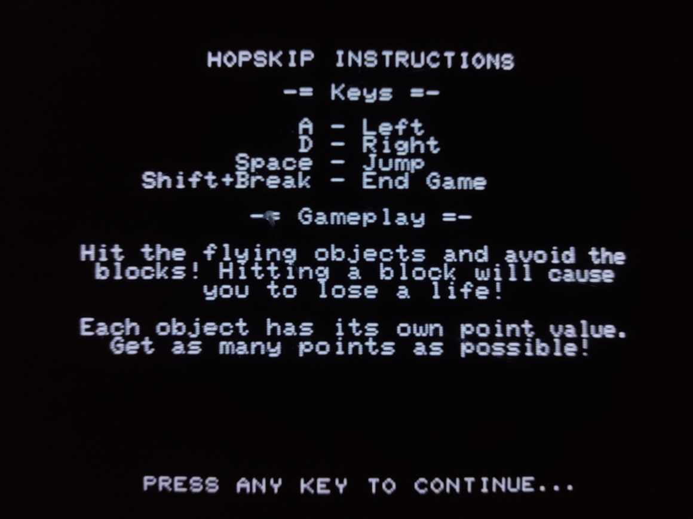
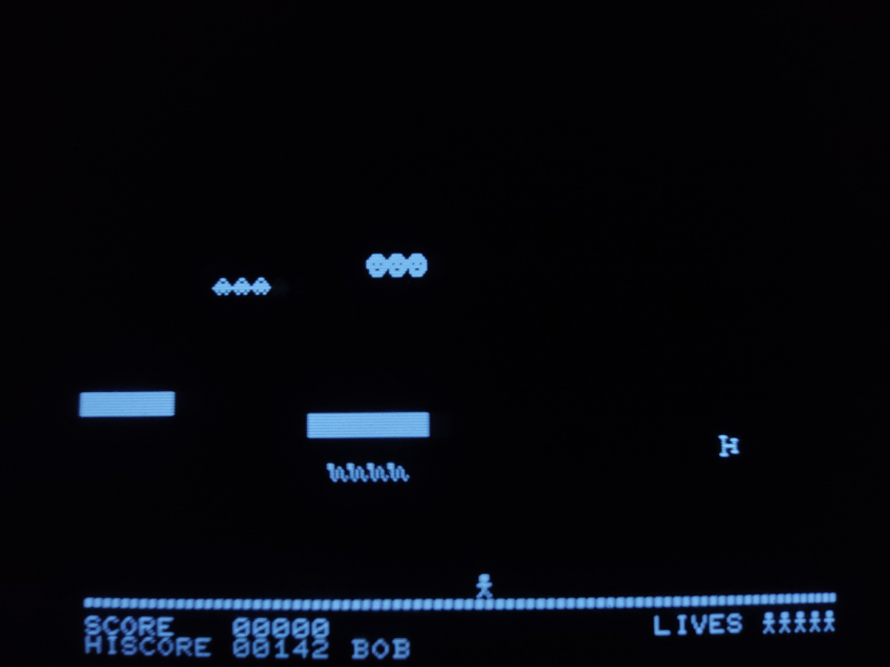
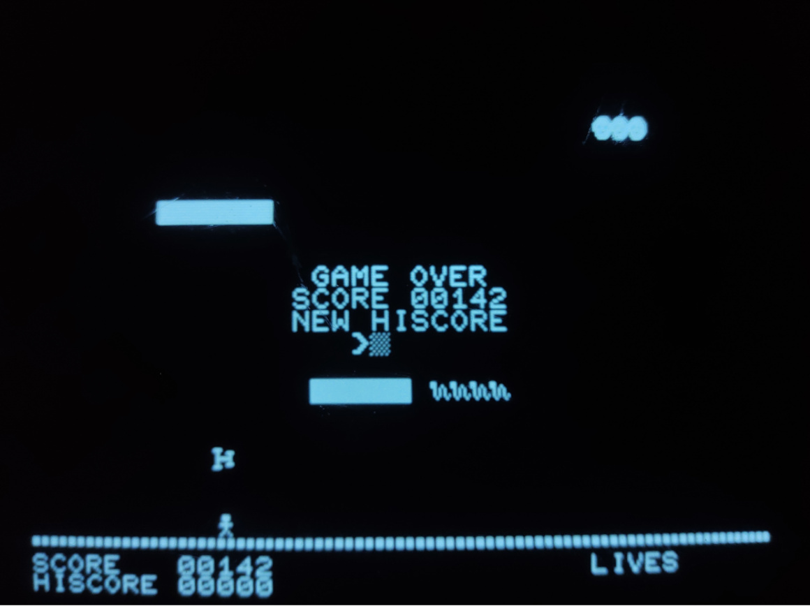
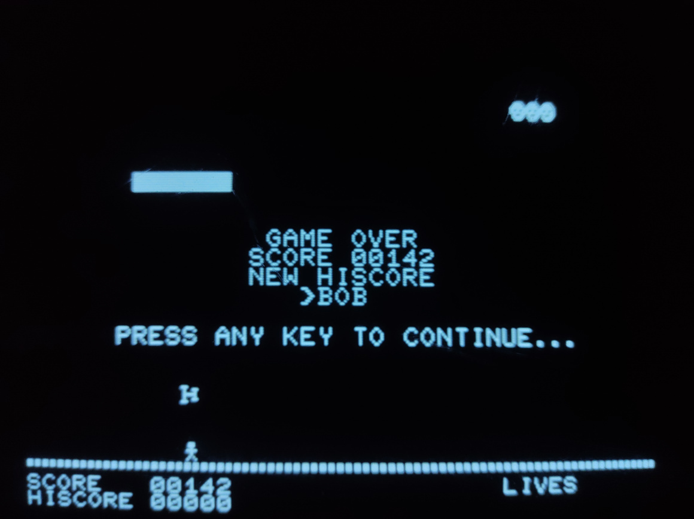

# MZ-80K Software Collection

## Brief Overview
The MZ-80K was introduced in 1978 in Japan, and 1979 in the UK. It contains a Zylog Z80-compatible processor running at 2MHz. The screen is monochrome and has a resolution of 40x25 characters. Individual pixels cannot be controlled - preset characters must be used instead. Video memory is shared with system memory and read/writes must be manually synchronized with v-blanking to avoid a "snow" effect.

Other information can be found at [original.sharpmz.org](https://original.sharpmz.org/).

### Tools Used
- The assembler: [Z80 Absolute Assembler](https://forum.sharpmz.org/viewtopic.php?p=2135#p2135)
- Emulator for rapid testing: [ttymz80](https://github.com/yunkya2/ttymz80)
- A more accurate emulator can be found here: [sharpmz emulators](https://original.sharpmz.org/mfranzenemu.htm)
  - The original site changed URLs, so the working download link is here: [V. 1.93h (Febrauary 02, 2010).](http://original.sharpmz.org/download/MZxx_internet.zip)
- For converting compiled binary to encoded WAV format: [mzf2wav](https://github.com/jfjlaros/mzf2wav)

***

## HopSkip

An arcade-style game where you must avoid solid blocks while jumping to collect objects flying across the screen. It uses fixed-point binary to control the acceleration, velocity, and position of the player for smooth movement despite the display limitations. The game has a high-score system which allows players to compete against each other and record their best performance.

### Screenshots
All screenshots were created by photographing the original hardware

#### Title Screen

#### Instruction Screen

#### Game

#### Gameover Screen

#### Gameover Screen 2
